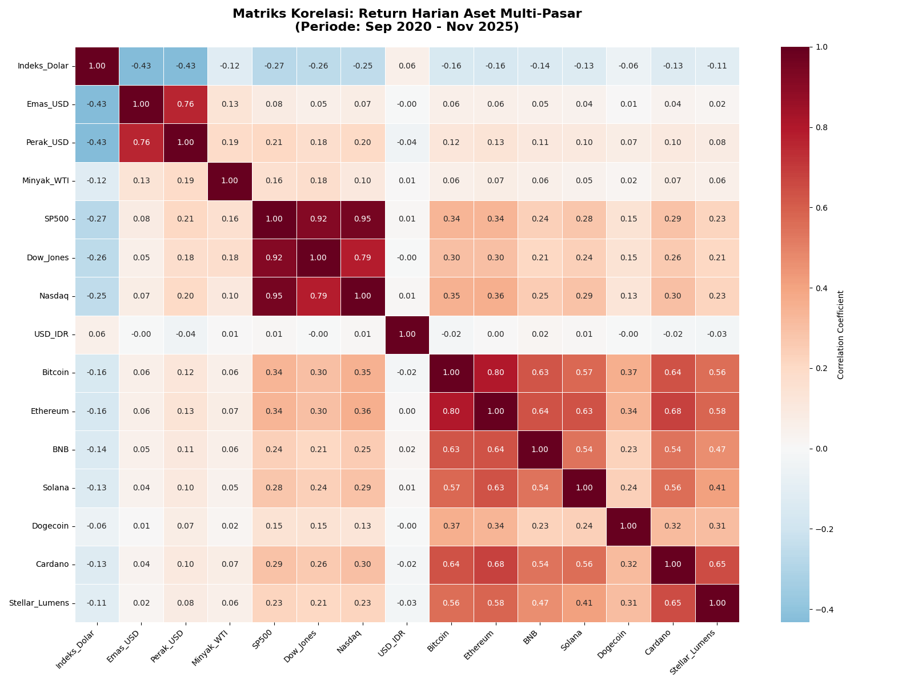
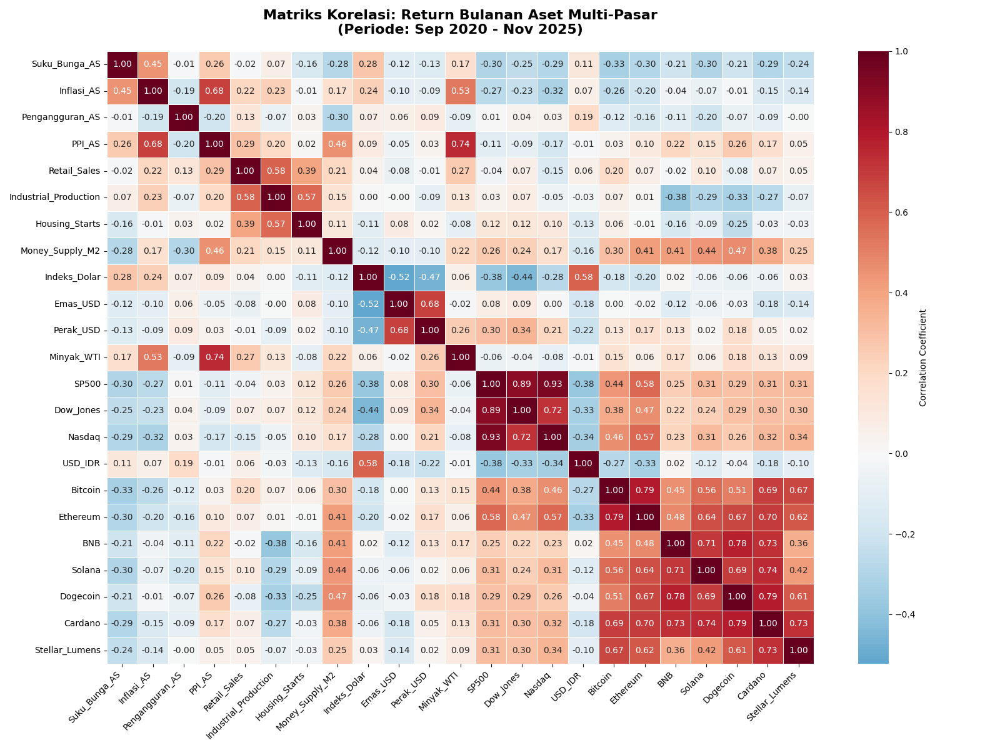
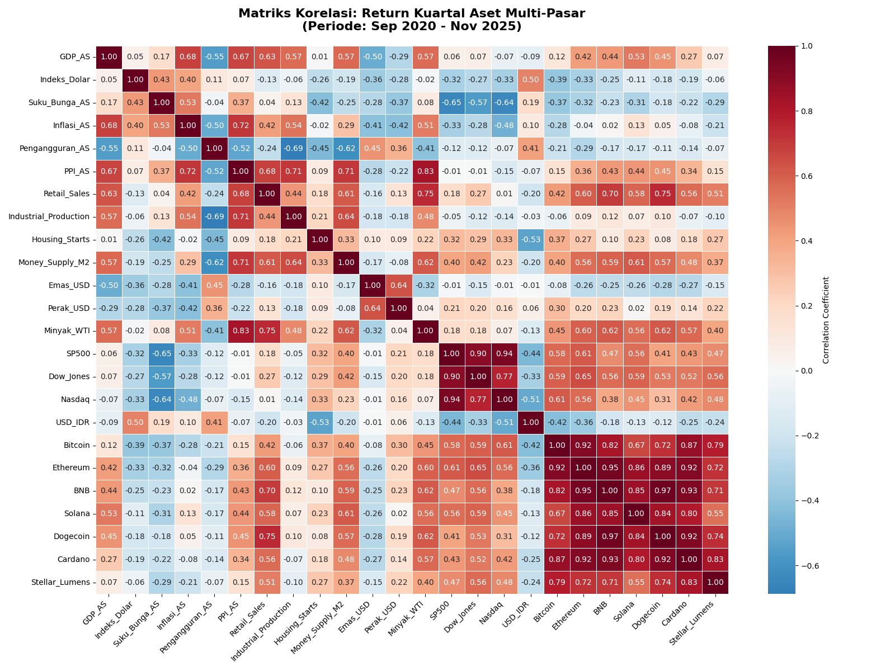

# bitcoin-macro-analysis
Python ETL pipeline integrating FRED (US Macro), Yahoo Finance (Global Markets), and Binance data to analyze historical correlations and Bitcoin price drivers.

# 📈 Bitcoin & Macroeconomic Correlation Analysis


> **Analisis Historis:** Studi kuantitatif mengenai pengaruh indikator makroekonomi (Inflasi, Suku Bunga, GDP) dan pasar global terhadap pergerakan harga aset kripto.

## 📋 Daftar Isi
- [Tentang Proyek](#-tentang-proyek)
- [Metodologi](#-metodologi)
- [Kamus Data](#-kamus-data)
- [Teknologi](#-teknologi)
- [Cara Penggunaan](#-cara-penggunaan)
- [Kontributor](#-kontributor)

## 📖 Tentang Proyek
Proyek ini menerapkan pipeline ETL (Extract, Transform, Load) sederhana untuk mengumpulkan data ekonomi historis dari berbagai sumber API. Tujuannya adalah membentuk dataset terpadu yang memungkinkan analisis korelasi antara aset berisiko tinggi (Bitcoin/Altcoins) dengan indikator ekonomi makro Amerika Serikat dan pasar tradisional.

## ⚙️ Metodologi
1.  **Data Extraction:** Mengambil data time-series historis melalui API (FRED, Yahoo Finance, Binance).
2.  **Preprocessing:** Pembersihan data `NaN` menggunakan metode *forward-fill/backward-fill* dan penyesuaian format tanggal.
3.  **Resampling:** Menyamakan frekuensi data (Harian, Bulanan, Kuartalan) untuk analisis korelasi yang valid.
4.  **Visualization:** Pembuatan Heatmap Korelasi dan plot Time Series.

## 🗃 Kamus Data
Berikut adalah variabel-variabel yang digunakan dalam analisis ini:

### 1. Indikator Makroekonomi (via FRED St. Louis)
| Ticker | Variabel | Freq Asli | Deskripsi |
| :--- | :--- | :--- | :--- |
| **DTWEXBGS** | Indeks Dolar | Harian | Indeks kekuatan USD terhadap mata uang global. |
| **FEDFUNDS** | Suku Bunga AS | Bulanan | Suku bunga acuan The Fed (Benchmark Interest Rate). |
| **CPIAUCSL** | Inflasi (CPI) | Bulanan | Indeks Harga Konsumen untuk mengukur inflasi. |
| **UNRATE** | Pengangguran | Bulanan | Persentase tingkat pengangguran di AS. |
| **PPIACO** | PPI | Bulanan | Indeks Harga Produsen (biaya produksi). |
| **RSXFS** | Retail Sales | Bulanan | Total penjualan ritel dan layanan makanan. |
| **INDPRO** | Industrial Prod. | Bulanan | Output total sektor industri. |
| **HOUST** | Housing Starts | Bulanan | Proyek pembangunan rumah baru. |
| **M2SL** | Money Supply M2 | Bulanan | Jumlah uang beredar (likuiditas ekonomi). |
| **GDP** | GDP AS | Kuartalan | Produk Domestik Bruto (Pertumbuhan Ekonomi). |

### 2. Pasar Tradisional (via Yahoo Finance)
| Ticker | Variabel | Kategori | Deskripsi |
| :--- | :--- | :--- | :--- |
| **GC=F** | Emas (Gold) | Komoditas | Aset Safe Haven. |
| **SI=F** | Perak (Silver) | Komoditas | Logam mulia industri & investasi. |
| **CL=F** | Minyak WTI | Komoditas | Biaya energi (Energy Costs). |
| **^GSPC** | S&P 500 | Saham | Tolak ukur pasar saham AS. |
| **^DJI** | Dow Jones | Saham | Indeks 30 industri utama AS. |
| **^IXIC** | Nasdaq | Saham | Indeks saham sektor teknologi (Risk-on). |
| **USDIDR=X**| USD/IDR | Forex | Nilai tukar Rupiah terhadap Dolar. |

### 3. Aset Kripto (via Binance)
| Ticker | Aset | Kategori |
| :--- | :--- | :--- |
| **BTC** | Bitcoin | Market Mover / Store of Value |
| **ETH** | Ethereum | Smart Contract Platform |
| **BNB** | BNB | Exchange Utility |
| **SOL** | Solana | Layer 1 Blockchain |
| **DOGE** | Dogecoin | Meme Coin |
| **ADA** | Cardano | Layer 1 Blockchain |
| **XLM** | Stellar | Payment Network |

## 🛠 Teknologi
* **Language:** Python 3.8+
* **Data Fetching:** `fredapi`, `yfinance`, `python-binance`
* **Data Manipulation:** `pandas`, `numpy`
* **Visualization:** `seaborn`, `matplotlib`

## 🚀 Cara Penggunaan

1.  **Clone repositori:**
    ```bash
    git clone [https://github.com/rafaelhartono8/bitcoin-macro-analysis.git](https://github.com/rafaelhartono8/bitcoin-macro-analysis.git)
    ```
2.  **Install library:**
    ```bash
    pip install fredapi python-binance yfinance pandas seaborn matplotlib
    ```
3.  **Setup API Key:**
    * Dapatkan Key gratis di [FRED St. Louis](https://fredaccount.stlouisfed.org/apikeys).
    * Masukkan key Anda ke dalam variabel `FRED_API_KEY` di notebook.
4.  **Jalankan Analisis:**
    Buka file `bitcoin-macro-analysis.ipynb` dan jalankan sel secara berurutan untuk menarik data historis terbaru dan menghasilkan visualisasi.

## 📉 Hasil Analisis (Preview)

Berikut adalah visualisasi Heatmap Korelasi dalam tiga timeframe berbeda. Warna **merah/gelap** menunjukkan korelasi positif kuat, sedangkan **biru/terang** menunjukkan korelasi negatif.

| 1. Korelasi Harian (Daily) | 2. Korelasi Bulanan (Monthly) | 3. Korelasi Kuartalan (Quarterly) |
| :---: | :---: | :---: |
|  |  |  |
| *Fokus pada volatilitas jangka pendek.* | *Menunjukkan tren makro yang lebih stabil.* | *Hubungan jangka panjang dengan GDP/Makro.* |

> **Insight Utama:**
> * **Bitcoin vs Tech Stocks:** Terlihat korelasi positif yang semakin menguat pada timeframe Bulanan dibandingkan Harian.
> * **Bitcoin vs DXY (Dolar):** Konsisten menunjukkan korelasi negatif (ketika Dolar menguat, Bitcoin cenderung melemah).
> * **Inflasi & Suku Bunga:** Dampak terlihat lebih signifikan pada data Kuartalan.

## 👥 Kontributor
* **Rafael Hartono** (166)
* **Nabil Putra Yuan** (126)

---
*Dibuat untuk memenuhi Tugas UAS Data Wrangling Universitas Negeri Surabaya.*
